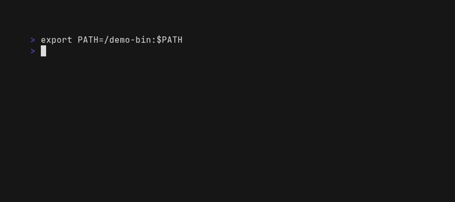

# Supdock

[](https://crates.io/crates/supdock)
[](https://www.npmjs.com/package/supdock)


What's Up, Doc(ker)? A convenient way to interact with the docker daemon. Supdock is a wrapper for the docker command meaning you can still use all of the other `docker` commands without issues.

<p align="center" />


## Why

Repetitive use of `docker ps`, `docker logs`, `docker stats` and `docker exec -ti` when troubleshooting complex container setups can get chaotic. Supdock aims to optimize and speed up your workflow using docker.



## Installation

### Script

```bash
curl -fsSL https://raw.githubusercontent.com/segersniels/supdock/master/scripts/install.sh | sh
```

### NPM

```bash
npm install -g supdock
```

Chances are you will run into issues with `yarn` due to symlink issues, so install through npm instead.

### Binary

Grab a binary from the [releases](https://github.com/segersniels/supdock/releases) page and move it into your desired bin (eg. /usr/local/bin) location.

```bash
mv supdock-<os> /usr/local/bin/supdock
chmod +x /usr/local/bin/supdock
```

## Alias

If you don't want to use `supdock` and `docker` separately you can just set an alias.

```bash
alias docker="supdock"
```

## Usage

```bash
What's Up, Doc(ker)? A convenient way to interact with the docker daemon.
Supdock is a wrapper for the docker command meaning you can still use all of the other docker commands without issues.

Usage:
  supdock [flags]
  supdock [command]

Available Commands:
  cat         Echo the contents of a file using cat on a container
  env         See the environment variables of a running container
  help        Help about any command
  prune       Remove stopped containers and dangling images
  ssh         SSH into a container

Options:
  -h, --help      help for supdock
  -v, --version   version for supdock

Use "supdock [command] --help" for more information about a command.

For more detailed usage on docker refer to "docker help"
```

Usage above can differ from the actual usage shown by the command.

## Changelog

For a basic changelog overview go [here](./CHANGELOG.md).
I try to keep track of most general changes as best as I can.

## Contributing & Troubleshooting

If you would like to see something added or you want to add something yourself feel free to create an issue or a pull request.
Please provide either the panic log or your terminal output with `RUST_LOG=debug` enabled for easier troubleshooting.
